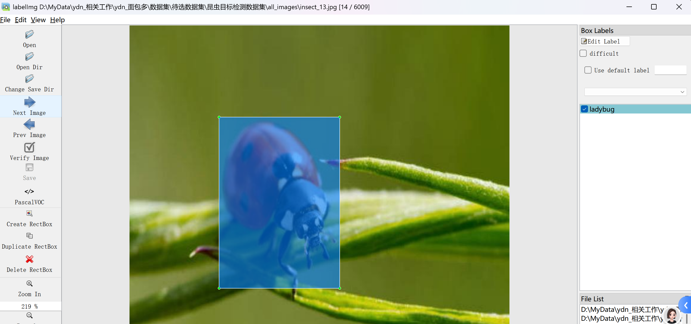

# Insect Detection - Target Detection Dataset

Dataset Information Introduction: There are a total of 6009 images and corresponding annotation files.
The annotation files come in two formats, including the VOC formatted xml file and the YOLO formatted txt file.
The target objects for detection include the following:
- Ants
- Aphids
- Blackspot
- Caterpillar
- Ladybug
- Powdery Mildew
- Thrips
- Whitefly

Each column contains information about the number of images and number of bounding boxes as follows: (the annotations are usually labeled in English, but Chinese characters are provided in parentheses for reference)
Note: An image may contain multiple targets, so the total number of bounding boxes might be greater than the total number of images.
The complete dataset consists of three folders and one txt file:
all_images: Stores the dataset's images, screenshots included:
all_txt: And classes.txt: Stores the YOLO formatted txt annotation files, in the same quantity as the images, each annotation file is paired with its image.
classes.txt:
For a detailed understanding of the YOLO formatted standard file, please search for it on your own. In short, the index 0 in the array represents the name of the object at the position 0 in the classes.txt file.
all_xml: The VOC formatted xml annotation file.
The number matches that of the images, and each annotation file is paired with its image.
For a detailed understanding of the VOC formatted standard file, please search for it on your own.
Both formats can be used, choose one based on your preference.
Annotation Screenshots:

## Picture

Here is a pay link on Stripe ( https://buy.stripe.com/3cs8yP7sY87d0vu9AB ). Please contact me lonlonago@foxmail.com after funding $89, and I will send you a complete data files , thank you!

